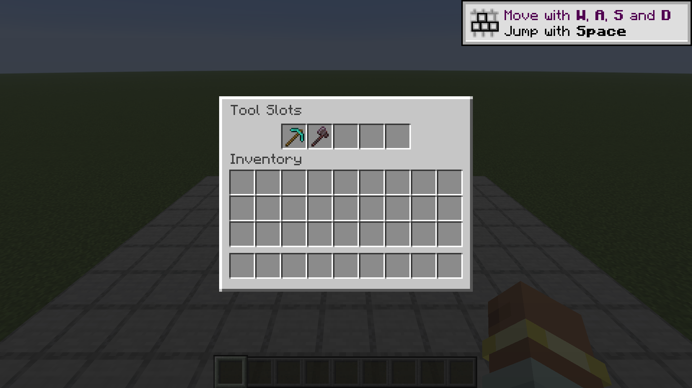

# Flatts's Things

**Status:** v0.5.0 uploaded to CurseForge 2026-09-08 as an alpha. The project is still Under Review,
so nothing is downloadable by anyone yet. Eleven features. Last reviewed 2026-09-08.

A grab bag of blocks, tools and small features that vanilla Minecraft never shipped.

There is no tech tree here and nothing gates anything else. Each thing stands on its own, which
means each thing has to be worth adding on its own. A mod like this is only as good as its worst
entry.

**MC 26.1.2 / NeoForge / Java 25.**

## What's in it

### Player Pressure Plates

A player-only counterpart to every vanilla pressure plate. Fourteen of them, one per vanilla plate,
each crafted shapelessly from that plate plus a redstone dust.

Vanilla ships two sensitivities and neither is this one. A wooden plate fires for any entity, so an
arrow you shot at it opens your door. A stone plate fires for any living entity, so a wandering cow
does. Neither can say "a player, and nothing else", which is what a door, a shop counter or a
trapped corridor actually wants.

Each variant is its vanilla counterpart in every respect but that: same hardness, map colour, note
block instrument, flammability, click sounds, 20-tick hold, redstone output of 15, and the same
vanilla tags, so a wooden one is still axe-mineable and a stone one still pickaxe-mineable.
Properties are copied from the vanilla block rather than restated, so they cannot drift. The texture is the one
visible difference, carrying a small figure so you can tell the two apart on the floor.


Front to back: the pressed state, the player plates, and the vanilla plates they are made from.

The two **weighted** plates have no counterpart. `light_weighted_pressure_plate` and
`heavy_weighted_pressure_plate` are a different block that counts dropped item stacks and outputs a
proportional signal; "player-only" has no meaning for a block whose whole job is weighing items.

### Tool slots

Five dedicated slots for your tools, under the inventory panel, that are not part of inventory
space. A pickaxe, axe, shovel and hoe stop eating four of your nine hotbar slots.



They are real slots in vanilla's own inventory menu rather than a screen of their own, so clicking,
dragging, stack splitting and tooltips are the game's and behave the way they do everywhere else.
Shift-click moves a tool in or out. Four of the five carry a faint outline of what belongs in them;
the fifth is deliberately blank, because it is the free one.

What fits is the `#flattsthings:tool_slot_valid` item tag, which defaults to the vanilla tool
families plus shears, so another mod's pickaxe fits with no compat patch and a pack can widen it in
a data pack. **Weapons are deliberately not in it.** These slots feed the auto-swap below, and a
storable sword would mean a mod that puts a weapon in your hand while you are mining.

**The strip is not on the creative inventory tab.** That is deliberate rather than unfinished: a
creative player has every item in the game two clicks away. Stored tools are untouched and come back
in survival.

### Tool auto-swap

Start breaking a block and the right tool comes out of your slots into your hand. Stop, and whatever
you were carrying comes back.

Selection is vanilla's own destroy-speed arithmetic, so a modded pickaxe sorts against a vanilla one
correctly and a tie goes to what you are already holding. The swap happens once, at the start of a
dig, because changing the held item resets destroy progress.

**Z toggles it**, under this mod's own category in Key Binds, and it says which way it went above
your hotbar. Your preference survives death and logout. It is your switch, not the pack's: it cannot
re-enable a swap a pack has turned off, and says so rather than pretending to toggle.

### Enchant a golden apple into an enchanted golden apple

The item's name says what it is, and vanilla has had no way to make one since 1.9. Put a golden
apple in an enchanting table, spend the levels and the lapis, and take out the real thing.

The offer is called **Blessing** and needs thirty levels, so a bare table cannot reach it and a full
ring of bookshelves is the price of admission. A Blessing book, which a table can roll onto a book
like any other enchantment, does the same job on an anvil.

### Silk touch picks up budding amethyst

Vanilla drops nothing for budding amethyst with any tool. This lets silk touch take it.

**This one changes the game rather than adding to it**, and the restriction it lifts is deliberate:
a budding block you cannot take is what stops an amethyst farm being picked up and moved. It ships on
like everything else, and its switch is there for packs that want vanilla's rule back.

### Three gravel makes one flint

Vanilla drops flint one time in ten, so getting a few means mining gravel until the dice cooperate.
Worse, gravel that does not roll flint drops as gravel, so with any Fortune shovel you can re-place
and re-break the same stack until every piece has become flint. This buys that loop out at three to
one: worse than any Fortune level in yield, better than digging unenchanted.

### Cauldron transforms

Dip a stack in a water cauldron and it comes out as something else. Concrete powder sets to
concrete; dirt becomes mud.

Both are things vanilla already lets you do the slow way. Concrete powder only sets against a water
**source block**, so the loop is carry a bucket, place a source, place powder against it one block at
a time, break the source, move on - a chore with no decision in it. Mud already comes from a water
bottle on dirt, one block at a time. The cauldron is the bulk version of both: a whole stack per
right-click, for one of the cauldron's three levels.

Washing dye off leather and filling bottles work exactly as they always did, and turning this off
gives you a completely ordinary cauldron. (A pack widening the tag should avoid items that already
have a cauldron use of their own, which this would take over.)

Packs extend it without code: which items react is the `#flattsthings:cauldron_transformable` item
tag, and what each becomes is the `flattsthings:cauldron_transform` data map.

### Armoured elytra

Put a chestplate and an elytra on an anvil. The chestplate comes back gliding, keeping its armour,
its enchantments, its trim and its name. One chest slot does both jobs.

The elytra is consumed - **and any enchantments on the elytra go with it**, since the chestplate is
the item that survives. Flight wears the **chestplate** from then on - so the thing being used up
is the armour keeping you alive, and it stops gliding one durability before it breaks, exactly as a
vanilla elytra does.

**This one changes the game rather than filling a gap in it.** The chestplate-or-elytra choice is a
cost Mojang has kept deliberately for years, and this removes it. Off puts that choice back.

### The woodcutter

A saw bench for wood. Put planks in, pick a shape, take it out.

**Logs go in too.** A log cuts into its planks at exactly the rate a bench gives - four, or two for
bamboo - and into a stripped log or a bark block one for one. Then planks cut into stairs and slabs,
at the rates a stonecutter already charges for stone: one plank per stair, where a bench wants one and
a half, and one plank per two slabs, which is what the bench wants anyway.

Planks also cut into **sticks** and **buttons**, and a stripped log into a **shelf** - all at the
bench's own rate.

**Doors, trapdoors, fences, signs and boats are deliberately not on it.** A cut takes one item, so
anything costing more than a plank on a bench would come out cheaper here - a fence gate is five
planks, and would be five times cheaper. Vanilla's stonecutter declines the same way: it cuts nothing
that costs more than one stone.

Twelve wood families. Bark and stripped forms go in too, wherever the family has them - bamboo has
no bark block, so it has none here either. Craft it from planks and an iron ingot.

The saving is small and only on stairs. The point is making a single stair without laying six planks
out in a grid, and changing your mind with one click. Vanilla has a cutter for stone and nothing for
wood, and that is not a principle - it is where Mojang stopped.

It is a block of its own rather than a new trick for the stonecutter, which was tried first and
rejected: a spinning stone blade is the wrong thing to be cutting planks on.

**Its body is drawn for it; the blade is the game's own.** The bench is generated wood - boards, a
bevelled edge, and a slot cut down the middle where the blade rises - and the saw itself is vanilla's,
because a blade is steel whatever bench it is bolted to and that is the part you already recognise as
"this block cuts things".

### Terrain slabs

Eleven half blocks of the ground: dirt, grass, mycelium, coarse dirt, rooted dirt, podzol, mud, clay,
gravel, sand and red sand. Vanilla gives slabs to the things you build with and none to the things you build on.

They behave rather than only looking right. Gravel and sand fall, and a top slab lands as a bottom
one rather than floating. Podzol goes snowy under snow, as a top or double slab - a bottom slab's
face is half way up its own block, so snow above never touches it. Rooted dirt grows hanging roots
when bonemealed, and refuses as a top slab where they would have nothing to hang from. Mud is two
pixels short, so you sink in.

Mining one gives half of what the block gives: a podzol slab yields a dirt slab, clay yields two clay
balls. Flint comes only from a DOUBLE gravel slab, which is a whole block's worth, so cutting gravel
up and recombining it is neutral.

Three blocks in a row give six slabs. **Gravel is the exception at six for twelve**, the same rate in
a bigger batch, because three gravel is already the flint recipe.

**Grass and mycelium spread and die back** the way their full blocks do, and a dirt slab beside a
grass block greens itself - the direction vanilla cannot manage on its own, since its grass looks for
a dirt block and never sees a slab. Spreading only crosses between matching halves.

### Powered rails from copper

The same recipe as the gold one, with copper where the gold goes, for three rails instead of six.
Vanilla puts the only rail that accelerates behind six gold, which is why early rail travel is mostly
pushing.

Half the yield is the point: a straight swap would leave the gold recipe with nothing to offer.
Copper buys rails early, gold stays worth using once you have it. It makes the ordinary powered
rail: there is no copper rail block and nothing oxidises.

## Every feature has a switch

`config/flattsthings-common.toml` carries one boolean per feature, all on by default.

A grab bag has to be a menu rather than a package deal, so a pack that wants the tool slots and not
the pressure plates can have exactly that. **Off means no new ones and never deletion:** a disabled
feature loses its recipe and its creative tab entry and stops running, while blocks already placed
keep working and tools already in a slot stay in it. A switch is always safe to flip back.

Recipes are turned off by a real data-pack condition rather than by hiding the item, which is the
only version of "off" that is also true in the recipe book and in JEI.

## Build and test

The system `JAVA_HOME` on the dev machine points at a JDK that does not exist, so **every** gradle
invocation needs it overridden:

```bash
JAVA_HOME="/c/Program Files/Java/jdk-25" ./gradlew build
```

| Task | Command |
| --- | --- |
| Compile only (fast feedback) | `./gradlew compileJava` |
| Full build + jar | `./gradlew build` |
| In-world GameTests (the real test layer) | `./gradlew runGameTestServer` |
| One test, or a wildcard group | `./gradlew runGameTestServer -Ptests=flattsthings:a_player_presses_the_player_plate` |
| Unit tests | `./gradlew test` |
| Merged coverage, both layers | `./gradlew test runGameTestServer -PgameTestCoverage coverageReport` |
| Dev client | `./gradlew runClient` |
| Fetch JEI + Jade into `run/mods` (dev client only) | `./gradlew fetchDevMods` |
| Regenerate IntelliJ run configs after `clean` | `./gradlew prepareAllRuns` |
| Regenerate plate resources (textures, models, recipes, tags, lang) | `python tools/generate_plates.py` |
| Build the dev world (once) | `python tools/make_dev_world.py` |
| Check for banned dashes | `python tools/check_dashes.py` |
| Check docs carry a dated status banner | `python tools/check_docs.py` |
| Redraw the logo | `python branding/compose_logo.py` |
| Capture the CurseForge gallery | `./gradlew runClient`, then `python tools/shoot_gallery.py --promote` |
| Publish to CurseForge (manual, needs a token) | `./gradlew publishCurseForge` |
| Screenshot every plate beside its vanilla counterpart | `./gradlew runClient`, then `python tools/shoot_plates.py` |

**Never pipe gradle to `tail` or `head` and trust the exit code.** The pipe reports the pager's
status (0) and masks a Gradle failure. Redirect to a file and check `$?`, or use `PIPESTATUS`.

## License

MIT.
