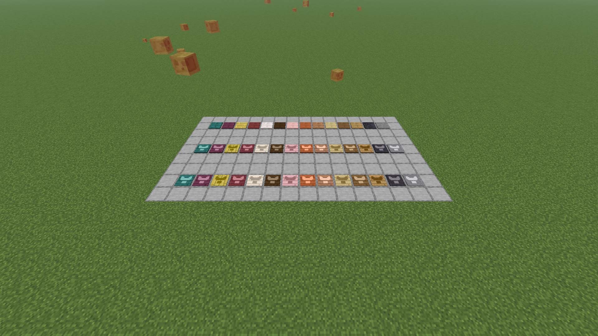

# Flatts's Things

A grab bag of blocks, tools and small features that vanilla Minecraft never shipped.

There is no tech tree here and nothing gates anything else. Each thing stands on its own, which
means each thing has to be worth adding on its own. A mod like this is only as good as its worst
entry.

**MC 26.1.2 / NeoForge / Java 25.**

## What's in it

### Player Pressure Plates

A player-only counterpart to every vanilla pressure plate. Fourteen of them, one per vanilla plate,
each crafted shapelessly from that plate plus an ender pearl.

Vanilla ships two sensitivities and neither is this one. A wooden plate fires for any entity, so an
arrow you shot at it opens your door. A stone plate fires for any living entity, so a wandering cow
does. Neither can say "a player, and nothing else", which is what a door, a shop counter or a
trapped corridor actually wants.

Each variant is its vanilla counterpart in every respect but that: same hardness, map colour, note
block instrument, flammability, click sounds, 20-tick hold, redstone output of 15, and the same
vanilla tags, so a wooden one is still axe-mineable and a stone one still pickaxe-mineable.
Properties are copied from the vanilla block rather than restated, so they cannot drift. The texture is the one
visible difference, carrying a small figure so you can tell the two apart on the floor.



Front to back: the pressed state, the player plates, and the vanilla plates they are made from.

The two **weighted** plates have no counterpart. `light_weighted_pressure_plate` and
`heavy_weighted_pressure_plate` are a different block that counts dropped item stacks and outputs a
proportional signal; "player-only" has no meaning for a block whose whole job is weighing items.

## Build and test

The system `JAVA_HOME` on the dev machine points at a JDK that does not exist, so **every** gradle
invocation needs it overridden:

```bash
JAVA_HOME="/c/Program Files/Java/jdk-25" ./gradlew build
```

| Task | Command |
| --- | --- |
| Compile only (fast feedback) | `./gradlew compileJava` |
| Full build + jar | `./gradlew build` |
| In-world GameTests (the real test layer) | `./gradlew runGameTestServer` |
| One test, or a wildcard group | `./gradlew runGameTestServer -Ptests=flattsthings:a_player_presses_the_player_plate` |
| Unit tests | `./gradlew test` |
| Merged coverage, both layers | `./gradlew test runGameTestServer -PgameTestCoverage coverageReport` |
| Dev client | `./gradlew runClient` |
| Regenerate IntelliJ run configs after `clean` | `./gradlew prepareAllRuns` |
| Regenerate plate resources (textures, models, recipes, tags, lang) | `python tools/generate_plates.py` |
| Build the dev world (once) | `python tools/make_dev_world.py` |
| Screenshot every plate beside its vanilla counterpart | `./gradlew runClient`, then `python tools/shoot_plates.py` |

**Never pipe gradle to `tail` or `head` and trust the exit code.** The pipe reports the pager's
status (0) and masks a Gradle failure. Redirect to a file and check `$?`, or use `PIPESTATUS`.

## License

MIT.
